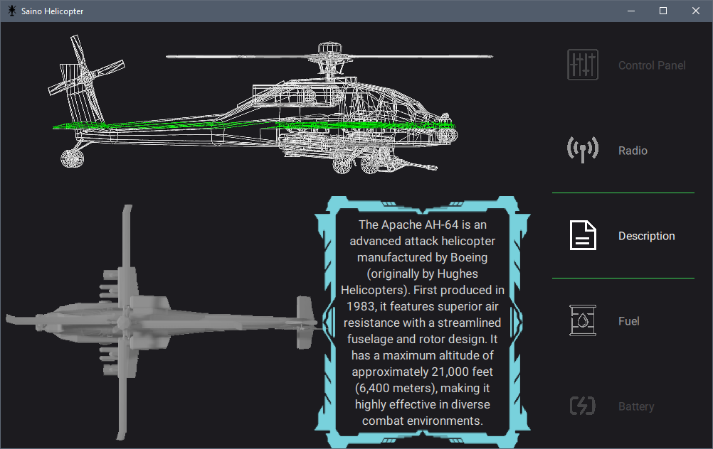
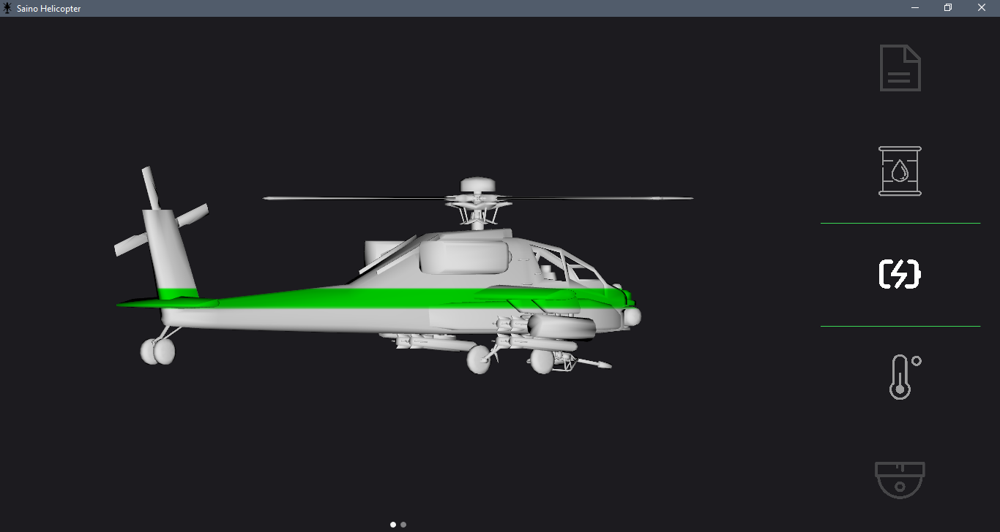
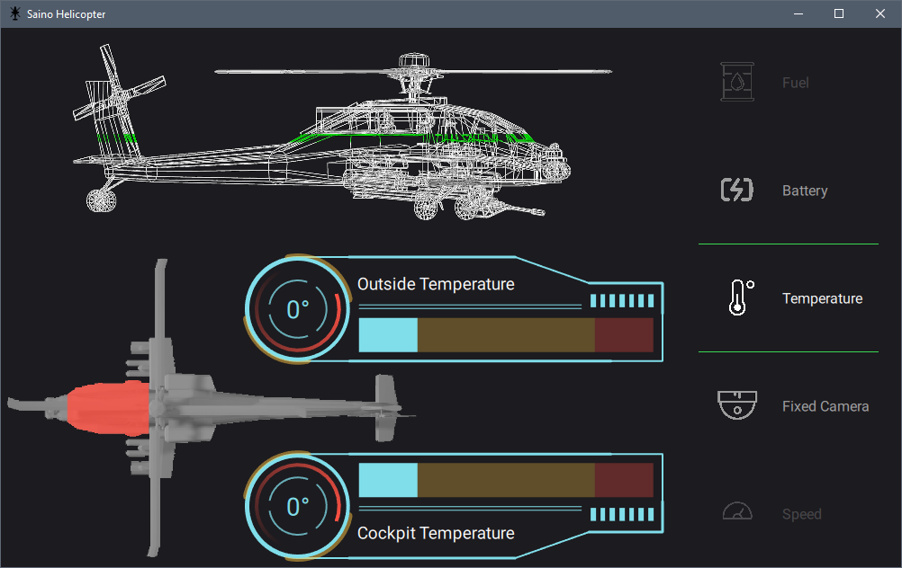
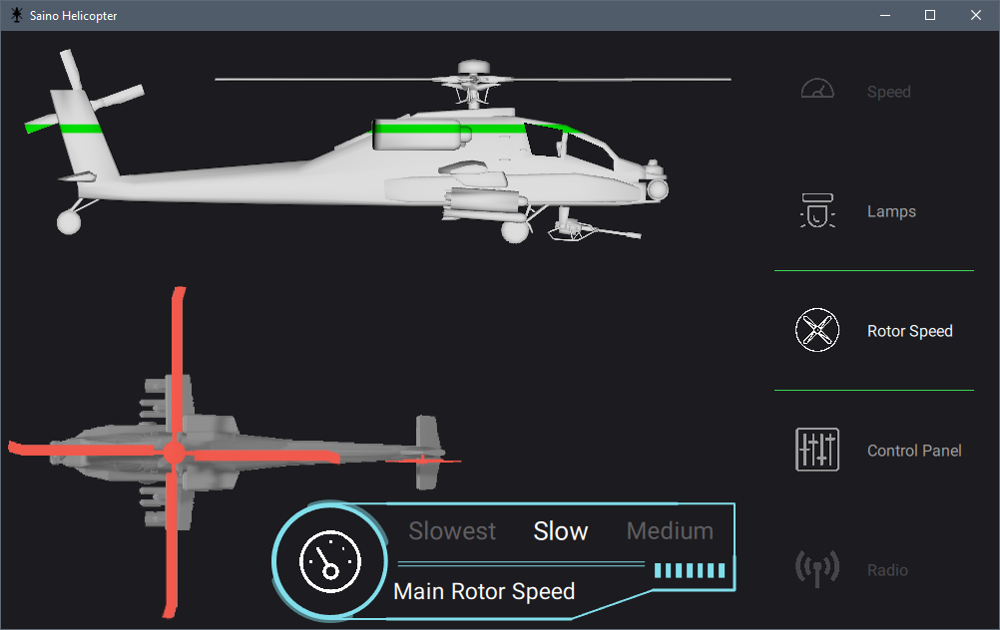
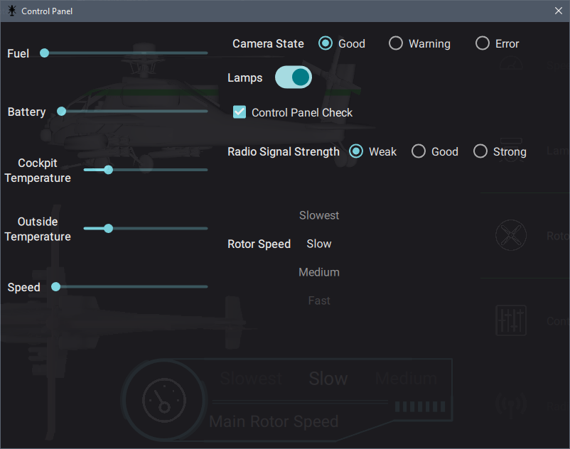

## Saino Helicopter – A QtQuick & Qt3D Showcase

🚁 **Saino Helicopter** is a QtQuick-based graphical project demonstrating a 3D helicopter model with interactive indicators and a futuristic control panel. This project was developed for a competition and is now available for educational purposes.

### ✨ Features

* **3D & 2D Helicopter Overview** – Switch between perspectives effortlessly.
* **Solid & Wireframe Modes** – Toggle between different rendering styles.
* **Interactive Indicators** – Monitor and adjust fuel, battery, speed, temperature, and more.
* **Control Panel** – Manually modify parameter values.
* **Smooth Animations** – A dynamic and polished UI experience.
* **Responsive Layout** – Adapts to different screen sizes.
* **Futuristic Design** – A theme compatible with Material aesthetics.

### 📸 Screenshots

### 📚 Learn from This Project

This project is a decent resource for those looking to explore **QtQuick, Qt3D, animations, and UI design** in Qt. Feel free to browse the code and gain insights into building interactive and visually appealing applications.

Open the project in **Qt Creator** (Qt 6 recommended).

### 📜 License

This project is provided as-is for  **educational purposes**. Feel free to explore and learn!
You may also use any of the components under GPLv3.
